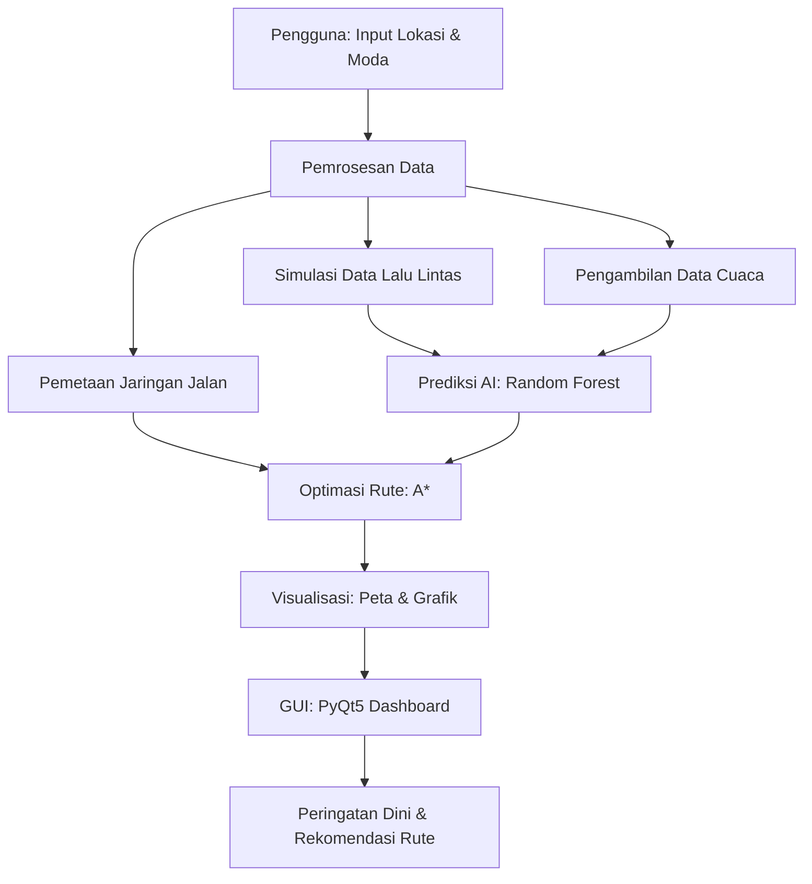

# 🚦 Bengkulu Smart Traffic

**Sistem Prediksi Kemacetan Lalu Lintas Berbasis AI**

Program ini adalah solusi berbasis kecerdasan buatan untuk memprediksi kemacetan lalu lintas di Kota Bengkulu, memberikan peringatan dini, merekomendasikan rute alternatif, dan menyediakan visualisasi interaktif melalui peta dan dashboard untuk mendukung inisiatif *Smart City Bengkulu*.

---

## 👥 Anggota Kelompok

| Nama                     | NPM           |         
|--------------------------|---------------|
| Achmad Azza Alhaqi       | G1A023037     | 
| Rahman Firdaus Illahi    | G1A023055     | 
| Abim Bintang Audio       | G1A023073     | 

---

## 🎯 Latar Belakang Masalah

Sebagai bagian dari inisiatif *Smart City Bengkulu*, kota ini menghadapi tantangan kemacetan lalu lintas yang memengaruhi mobilitas urban, efisiensi waktu, dan kualitas hidup masyarakat. Sistem ini dirancang untuk:
- Memberikan peringatan dini terhadap potensi kemacetan
- Merekomendasikan rute alternatif secara real-time
- Menyediakan analisis dan visualisasi data lalu lintas untuk perencanaan kota

---

## 🔍 Fitur Utama Sistem

Berikut adalah fitur utama sistem beserta tampilannya dalam antarmuka pengguna:

| Fitur                              | Tampilan                                                                 |
|------------------------------------|--------------------------------------------------------------------------|
| **Sistem Peringatan Dini**         | Notifikasi berwarna (merah untuk *CRITICAL*, kuning untuk *HIGH*) di tab "Peringatan Dini" GUI *PyQt5*. Ringkasan tingkat kemacetan ditampilkan di dashboard real-time dengan teks dan ikon status. |
| **Analisis dan Visualisasi**       | Tab "Visualisasi" GUI menampilkan grafik statis (*Matplotlib*, *Seaborn*): diagram lingkaran (distribusi lokasi), batang (tingkat lalu lintas), sebar (kecepatan vs kemacetan), dan peta panas (korelasi fitur). Dashboard interaktif (*Plotly*) dengan grafik batang dan sebar. Peta kemacetan (*Folium*) dengan *HeatMap* di tab "Pemantauan". |
| **Antarmuka Pengguna**             | GUI *PyQt5* dengan empat tab: Pemantauan, Peringatan, Rute, dan Visualisasi. Input lokasi melalui *QComboBox* dengan daftar tempat. Pembaruan real-time setiap 60 detik ditampilkan sebagai ringkasan status di tab Pemantauan. |

### 🛣️ Rekomendasi Rute Cerdas

| Fitur                              | Tampilan Jarak                                   | Tampilan Peta                                    |
|------------------------------------|--------------------------------------------------|--------------------------------------------------|
| **Rekomendasi Rute Cerdas**        | Jarak rute (dalam kilometer) ditampilkan di tab "Rute" GUI *PyQt5* untuk hingga 3 rute alternatif per moda (mobil, motor, jalan kaki). Estimasi waktu tempuh ditunjukkan berdasarkan kondisi lalu lintas dan cuaca. | Peta interaktif (*Folium*) di tab "Rute" menampilkan jalur rute dengan warna berbeda untuk setiap alternatif. Titik awal dan tujuan ditandai dengan marker. *HeatMap* menunjukkan tingkat kemacetan di sekitar rute. |

---

## 🧠 Model AI dan Justifikasi Pemilihan

### 🎯 Model Utama: Random Forest Classifier

#### Justifikasi Pemilihan:
1. **Penanganan Data Kompleks**
   - Efektif untuk data numerik (volume kendaraan, kecepatan) dan kategorikal (cuaca, tipe jalan)
   - Tahan terhadap *outliers* dan data yang bising, seperti dalam simulasi lalu lintas
2. **Klasifikasi Multi-Kelas**
   - Mengklasifikasikan tingkat kemacetan: *Lancar*, *Sedang*, *Padat*, *Macet*
   - Akurasi tinggi dengan risiko *overfitting* rendah berkat metode *ensemble*
3. **Interpretabilitas**
   - Menyediakan *feature importance* untuk mengidentifikasi faktor utama kemacetan
   - Mendukung pengambilan keputusan yang transparan
4. **Skalabilitas**
   - Cocok untuk data sintetis dan real-time di Kota Bengkulu
   - Mendukung pembaruan model secara berkala

#### Arsitektur Model:
```plaintext
Input Features → Preprocessing → Random Forest → Output
    ↓               ↓                  ↓             ↓
- hour           - LabelEncoder    - 100 trees    - Lancar (>30 km/h)
- day_of_week    - StandardScaler  - Max depth=None- Sedang (15-30 km/h)
- weather        - Feature eng.    - Bootstrap=True- Padat (10-15 km/h)
- vehicle_count  - Data validation - Random state=42- Macet (<10 km/h)
- congestion_ratio
- avg_speed
- road_type
```

---

## 📊 Data dan Metodologi Pengumpulan

### 🎲 1. Data Sintetis
**Sumber:** `TrafficDataGenerator` (*data_generator.py*)
**Metode Pengumpulan:**
- Simulasi data menggunakan distribusi *normal* dan *uniform*
- Faktor: waktu (jam, hari), cuaca, tipe jalan, dan peristiwa acak (misalnya kecelakaan)
- Parameter utama:
  - `vehicle_count`: Distribusi normal dengan penyesuaian jam sibuk
  - `avg_speed`: Dipengaruhi oleh rasio kemacetan dan cuaca
  - `congestion_ratio`: Rasio jumlah kendaraan terhadap kapasitas jalan

**Preprocessing:**
```python
# Contoh data sintetis
data = {
    'location': ['Pasar Minggu', 'Simpang Lima', ...],
    'vehicle_count': np.random.normal(100, 30, size=n),
    'avg_speed': np.random.normal(40, 10, size=n) * (1 - congestion_ratio),
    'congestion_ratio': vehicle_count / road_capacity,
    'weather': np.random.choice(['Cerah', 'Hujan Ringan', 'Hujan Lebat'], p=[0.6, 0.3, 0.1])
}
```

### 🗺️ 2. Data Geospasial
**Sumber:** OpenStreetMap (OSM) via *OSMnx* (*route_recommendation.py*)
**Metode Pengumpulan:**
- Mengunduh graf jaringan jalan Kota Bengkulu (tipe: *drive*, *walk*)
- Cache graf ke file `.pkl` untuk efisiensi
- Pemetaan lokasi ke node terdekat menggunakan koordinat geografis

**Fitur Data:**
- Koordinat (latitude, longitude) untuk 40+ lokasi di Bengkulu
- Tipe jalan (*arterial*, *collector*, *highway*, *local*)
- Atribut: panjang jalan, batas kecepatan, preferensi rute

### 🌤️ 3. Data Cuaca
**Sumber:** OpenWeatherMap API (*route_recommendation.py*)
**Metode Pengumpulan:**
- Panggilan API setiap 30 menit untuk data cuaca real-time
- Parameter: kondisi cuaca (cerah, hujan, berawan), intensitas cuaca
- Fallback ke intensitas default jika API gagal

**Preprocessing:**
- Kategorisasi cuaca ke intensitas (0.0 untuk cerah, 0.5 untuk hujan ringan, 1.0 untuk hujan lebat)
- Integrasi dengan bobot rute untuk penyesuaian waktu tempuh

### 📈 4. Data Preparation Pipeline
```python
# Contoh pipeline preprocessing
def preprocess_data(df):
    # Validasi kolom dan tipe data
    # Menangani nilai yang hilang
    # Feature engineering: is_weekend, is_central, hour_weather_interaction
    # Encoding kategori (weather, road_type, traffic_level)
    # Normalisasi fitur numerik menggunakan StandardScaler
    # Pembagian data: 80% train, 20% test
```

---

## 🔄 Alur Kerja Sistem

### 1. 📥 Input Pengguna
- **Lokasi:** Pilih dari daftar lokasi (misalnya, Pasar Minggu, Simpang Lima)
- **Moda Transportasi:** Mobil, motor, atau jalan kaki
- **Validasi:** Memastikan lokasi valid dan berbeda

### 2. 🔄 Pemrosesan Data
- **Simulasi Data:** `TrafficDataGenerator` menghasilkan data lalu lintas sintetis
- **Pembaruan Real-time:** Data diperbarui setiap 60 detik melalui *DataUpdateThread*
- **Geospasial:** Pemetaan lokasi ke node jaringan jalan menggunakan *OSMnx*

### 3. 🧠 Prediksi AI
- **Model:** `RandomForestClassifier` memprediksi tingkat kemacetan
- **Fitur:** Jam, hari, cuaca, jumlah kendaraan, kecepatan rata-rata, tipe jalan
- **Output:** Klasifikasi (Lancar, Sedang, Padat, Macet) dengan skor kepercayaan

### 4. 🛣️ Optimasi Rute
- **Algoritma:** *A*** dengan bobot dinamis berdasarkan kemacetan, kecepatan, dan cuaca
- **Jaringan:** Graf terpisah untuk mobil/motor (*drive*) dan pejalan kaki (*walk*)
- **Rute Alternatif:** Hingga 3 rute per moda dengan penalti untuk variasi

### 5. 📱 Visualisasi dan Antarmuka
- **GUI:** *PyQt5* dengan tab untuk pemantauan, peringatan, rute, dan visualisasi
- **Peta:** *Folium* untuk peta interaktif dengan *HeatMap* dan jalur rute
- **Grafik:** *Matplotlib*/*Seaborn* untuk analisis (diagram lingkaran, batang, sebar, peta panas)
- **Dashboard:** *RealTimeMonitoringDashboard* untuk ringkasan kondisi lalu lintas

### 📋 Diagram Alur Sistem


---

## 🎯 Strategi Evaluasi Model

### 📊 1. Metrik Evaluasi

#### A. Classification Metrics
```python
metrics = {
    'accuracy': accuracy_score(y_test, y_pred),
    'f1_score': f1_score(y_test, y_pred, average='weighted'),
    'confusion_matrix': confusion_matrix(y_test, y_pred)
}
```

#### B. Business Metrics
- **Akurasi Peringatan:** Persentase peringatan *CRITICAL*/*HIGH* yang akurat
- **Efisiensi Rute:** Pengurangan waktu tempuh rata-rata
- **Waktu Respon Sistem:** <2 detik untuk pembaruan data dan rute

### 🔄 2. Metodologi Validasi
- **Cross-Validation:** 5-fold cross-validation menggunakan *StratifiedKFold*
- **Train-Test Split:** 80% pelatihan, 20% pengujian
- **Validasi Temporal:** Simulasi data berdasarkan waktu untuk meniru pola harian

### 📈 3. Pemantauan Performa
- **Deteksi Drift:** Memantau distribusi fitur untuk mendeteksi perubahan pola
- **Pemicu Pelatihan Ulang:** Akurasi <85% memicu pelatihan ulang
- **Log Sistem:** Menggunakan *logging* untuk melacak performa dan error

### 🎯 4. Target Performa
| Metrik                     | Target Minimal | Target Optimal |
|----------------------------|----------------|----------------|
| Classification Accuracy     | 85%            | 92%            |
| Alert Precision            | 80%            | 90%            |
| System Response Time       | <2 detik       | <1 detik       |
| Route Time Improvement     | 15%            | 25%            |

---

## 🛠️ Teknologi dan Arsitektur Sistem

### 💻 1. Technology Stack

#### Backend & AI/ML
- **Python 3.8+**: Bahasa utama
- **Scikit-learn**: Random Forest Classifier
- **Pandas & NumPy**: Manipulasi dan analisis data
- **OSMnx & NetworkX**: Analisis jaringan jalan

#### Frontend & Visualisasi
- **PyQt5**: Antarmuka GUI desktop
- **Folium**: Peta interaktif
- **Matplotlib & Seaborn**: Visualisasi statis
- **Plotly**: Dashboard interaktif

#### Data & Integrasi
- **Requests**: Panggilan API OpenWeatherMap
- **Threading & QThread**: Pemrosesan asinkronus untuk pembaruan data, kalkulasi rute, dan pembuatan peta
- **Logging**: Pemantauan dan debugging sistem

### 🏗️ 2. Arsitektur Sistem
```
┌─────────────────────────────────────────────────────────────┐
│                    Presentation Layer                        │
├─────────────────────────────────────────────────────────────┤
│  PyQt5 GUI  │  Folium Maps  │  Plotly Dashboard  │  Alerts  │
├─────────────────────────────────────────────────────────────┤
│                      Business Logic Layer                   │
├─────────────────────────────────────────────────────────────┤
│ Route Optimizer │ Traffic Predictor │ Alert Manager │ APIs │
├─────────────────────────────────────────────────────────────┤
│                        AI/ML Layer                          │
├─────────────────────────────────────────────────────────────┤
│ Random Forest │ Feature Engineering │ Model Pipeline │      │
├─────────────────────────────────────────────────────────────┤
│                       Data Layer                            │
├─────────────────────────────────────────────────────────────┤
│ OSM Data │ Weather API │ Synthetic Data │ Geospatial DB │    │
└─────────────────────────────────────────────────────────────┘
```

---

## 📦 Instalasi dan Deployment

### 🔧 1. Prasyarat
```bash
Python >= 3.8
Memory >= 4GB RAM
Storage >= 2GB free space
Koneksi internet (untuk API dan OSM)
```

### ⚡ 2. Langkah Instalasi
```bash
# Clone repository (jika tersedia)
git clone https://github.com/AchmadAzza44/Bengkulu-Smart-Traffic
cd bengkulu-traffic-ai

# Buat virtual environment
python -m venv traffic_env
source traffic_env/bin/activate  # Linux/Mac
# traffic_env\Scripts\activate     # Windows

# Install dependensi
pip install numpy pandas python-dateutil pytz PyQt5 matplotlib seaborn plotly folium osmnx networkx geopy requests scikit-learn

# Jalankan aplikasi
python main.py
```

### 📋 3. Dependensi
```txt
# Core ML & Data Processing
numpy>=1.21.0
pandas>=1.3.0
scikit-learn>=1.0.0

# Geospatial & Mapping
osmnx>=1.2.0
networkx>=2.6.0
folium>=0.12.0

# GUI & Visualization
PyQt5>=5.15.0
matplotlib>=3.4.0
seaborn>=0.11.0
plotly>=5.0.0

# API & Utilities
requests>=2.26.0
python-dateutil>=2.8.0
pytz>=2021.1
```

---

## 🚀 Pengembangan Lanjutan

### 📱 1. Integrasi Mobile
- Aplikasi Android/iOS menggunakan *React Native*
- Notifikasi push untuk peringatan kemacetan
- Integrasi GPS untuk pelacakan lokasi
- Mode offline dengan cache data

### 🎯 2. Fitur AI Lanjutan
- **Prediksi Jangka Pendek:** Menggunakan LSTM untuk pola waktu
- **Analisis Gambar:** CNN untuk deteksi kemacetan dari kamera
- **Pembelajaran Online:** Pembaruan model secara real-time
- **Federated Learning:** Privasi data pengguna

### 🌐 3. Integrasi Smart City
- **Sensor IoT:** Kamera lalu lintas dan sensor kendaraan
- **Lampu Lalu Lintas Cerdas:** Integrasi untuk pengaturan dinamis
- **Platform Big Data:** *Apache Kafka* untuk streaming data
- **Analitik Real-time:** *Apache Superset* untuk dashboard

### 🤝 4. Fitur Komunitas
- **Pelaporan Masyarakat:** Laporan insiden oleh pengguna
- **Validasi Komunitas:** Verifikasi data oleh pengguna
- **Integrasi Pemerintah:** API untuk data terbuka
- **Transportasi Umum:** Integrasi jadwal dan rute

### 🎨 5. Peningkatan Pengalaman Pengguna
- **Personalisasi:** Rekomendasi berdasarkan kebiasaan pengguna
- **Bahasa:** Dukungan multi-bahasa
- **Analitik Lanjutan:** Prediksi dampak lingkungan dan ekonomi

---


---

